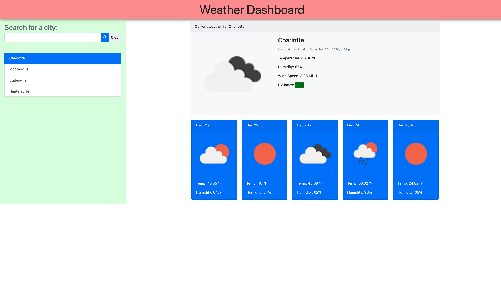

# weather-dashboard

## Description
This weather search webpage uses Third-party APIs which allow developers to access their data and 
functionality by making requests with specific parameters to a URL. When this web-page is loaded 
into the browser it will dynamically updated HTML and CSS with searched city's current and 5 day 
fortcasted weather predictions.

## User Story
AS A traveler
I WANT to see the weather outlook for multiple cities
SO THAT I can plan a trip accordingly

## Technologies Uses
* HTML
* CSS
* Javascript
* Third-Party APIs

## Image of Webpage

